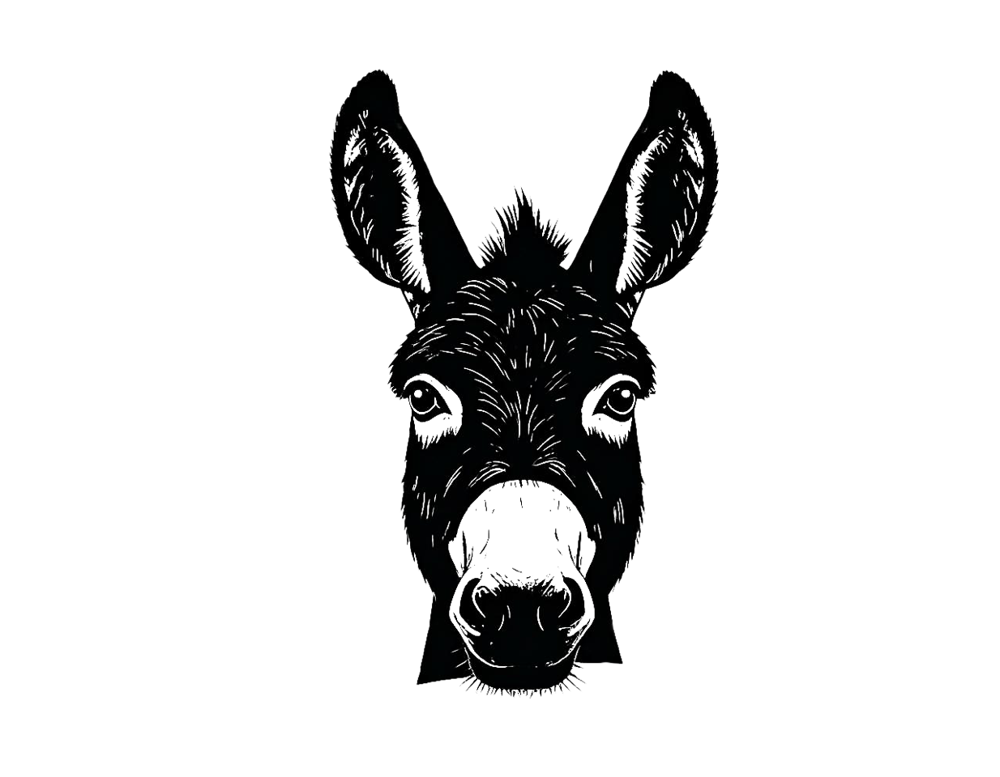

# 🫏 Picoteo - E-commerce MVP

<div align="center">
  
  
</div>

## 🥘 What is Picoteo?

**Picoteo** is inspired by the Spanish tradition of "tapas" - a little bit of everything! Just like how Spaniards enjoy small plates of diverse delicious foods, Picoteo aims to be an e-commerce platform targeting local produce and seasonal items. Picoteo will aim to bring community awareness between users and businesses, creating connections that strengthen local economies and foster meaningful relationships between customers and the passionate entrepreneurs in their neighborhoods.

## 👨‍💻 About the Developer

- 🌐 Visit my website: [donkeydrills.com/claude7daychallenge](https://donkeydrills.com/claude7daychallenge)
- 🐦 Follow me on X for documentating my journey: [@donkeydrills](https://x.com/donkeydrills)

## 🤖 Claude 7-Day Challenge

This project is part of the incredible [Claude 7-Day Challenge](https://x.com/alexalbert__/status/1973071320025014306/photo/1) by [@alexalbert\_\_](https://x.com/alexalbert__) - an amazing initiative to explore what's possible when humans and AI collaborate to build real applications in just 7 days!

## ✨ Features

- 🏪 **Multi-Shop Marketplace** - Browse different shops and their products
- 🛒 **Basket Management** - Add products from multiple shops with price calculation
- 👤 **Customer Registration** - Simple onboarding for new customers - via google auth
- 📦 **Order Processing** - Complete checkout flow with order tracking
- 📱 **Responsive Design** - Works perfectly on desktop and mobile - mobile first for customers
- 🎨 **Clean UI** - Built with Tailwind CSS for a modern look

## 🗂 Database Schema

Our application follows this comprehensive schema design (v2):


## 🚀 Tech Stack

<div align="center">

### Frontend


### Backend


### Development


</div>

**Why Convex?** 🌟

- **Real-time by default** - Live updates across all connected clients
- **Type-safe** - Full TypeScript support from database to frontend
- **Zero config** - No need to set up complex database infrastructure
- **Optimistic updates** - Instant UI feedback with automatic rollback
- **Built-in auth** - Simple yet powerful authentication system

## 📁 Project Structure

```
├── src/
│   ├── app/                 # Next.js App Router pages
│   │   ├── basket/         # Shopping basket
│   │   ├── checkout/       # Order processing
│   │   ├── shops/          # Shop listings & products
│   │   └── order-success/  # Confirmation page
│   ├── components/         # Reusable UI components
│   └── hooks/             # Custom React hooks
├── convex/                # Backend functions & schema
│   ├── schema.ts          # Database schema
│   ├── shops.ts           # Shop queries
│   ├── products.ts        # Product queries
│   ├── baskets.ts         # Basket management
│   ├── orders.ts          # Order processing
│   └── seedData.ts        # Sample data
└── public/               # Static assets
```

## 🌟 Future Enhancements

- 🔍 Product in stock
- 💳 Payment integration (Stripe)
- 📊 Shop owner dashboard
- 🚚 Delivery tracking

## 🤝 Contributing

This project was built as part of a learning challenge, i'll be happy to talk more via a calendy booking on my portfolio donkeydrills - software development for all.

---

<div align="center">
  <p>Built  by <a href="https://donkeydrills.com">DonkeyDrills</a> and Claude AI</p>
  <p>Part of the <a href="https://x.com/alexalbert__/status/1973071320025014306/photo/1">Claude 7-Day Challenge</a></p>
</div>
